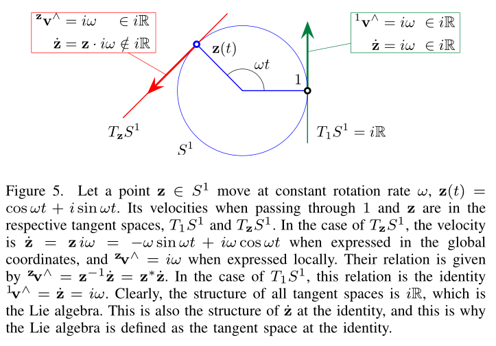
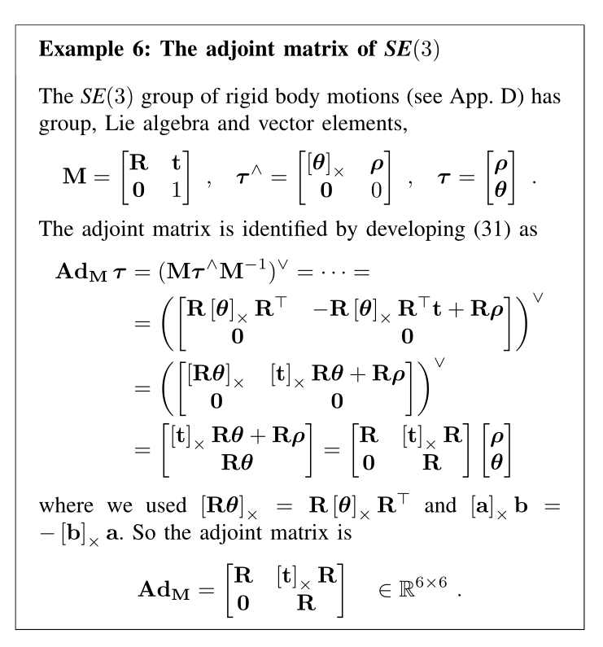
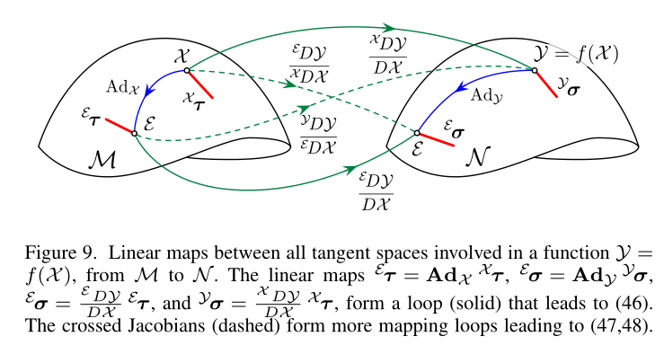

# A micro Lie theory for state estimation in robotics

## Abstract

李群是一个古老抽象的数学对象，可以追溯到十九世纪，多年后，在现在的机器人领域中，至少是在状态估计领域尤其是针对导航的运动估计，其扮演了越来越重要的角色。然而，对于绝大多数机器人专家来说，李群是高度抽象的结构，因此很难理解和使用。在状态估计中，我们不需要应用其全部的理论，因此需要从中挑选出我们需要的部分。在这篇文章中，我们将展示最基本的李群相关理论，旨在传达一些清晰有用的想法，为机器人状态估计领域留下一份重要的关于李群的资料。尽管存在缺陷，但这里包含的内容在机器人估计算法中非常有用，特别是在SLAM、视觉里程计等领域。除此之外，我们还提供了几个应用示例以及常用的公式，还展示了一个C++模板库，它实现了本文描述的所有功能。

## I. INTRODUCTION

Fig1. 该图展示了李群与李代数之间的关系。李代数 $T_{\cal{E}}\cal{M}$(红色平面)是李群的流形 $\cal{M}$（蓝色表示）在幺元 ${\cal{E}}$处的切空间。通过指数映射，通过李代数上原点的每条直线 路径 $\mathbf{v}t$会产生围绕流形的路径 $\rm{exp}(\mathbf{v}t)$，该路径沿着各自的延伸。相 反，群中的每个元素在李代数中都有一个等价元素。这种关系的意义是如此深刻，以至于（几乎）弯曲 和非线性的群中的所有运算在李代数中都是完全等价的，而李代数是一个线性向量空间。这里需要说明 的是 $\mathbb{R}^3$中的球体不是李群（我们只是用它来表示以使得其可以在纸上画出来），但是 $\mathbb{R}^4$中的球体是，它代表单位四元数。

借助李群的理论，我们可以建立一个严格的微积分语料库来处理状态估计问题中的不确定性、导数 和积分。典型地，这些工作集中在旋转$SO(3)$和刚性运动$SE(3)$流形上。第一次接触李群时，尝试从 不同的角度去看待它是十分重要的。从拓扑的角度来说，如Fig1，它描述了流形的形状，并直观地展示 了李群与其切空间的关系以及什么是指数映射。从代数的角度来说，它涉及到群运算以及其具体实现， 通过代数性质来推出封闭形式的公式或化简它们。从几何的角度来说（在机器人学中非常有用），它将 群元素与本体或参考系的位置、速度、旋转相联系。初始系可能被定义为李群中的幺元，流形中的其它 点代表着某一确定的局部系。通过这些类比，李群中许多抽象的数学概念可以更加接近向量空间、运动 学和其他更经典的领域中的直观概念。李群绝不简单，为了掌握李群的基本概念，可以参考以下三份材 料：1.Abbaspour的“Basic Lie theory”（400多页）；2.Howe的“Very basic Lie theory”（24页）； 3.Stillwell的“Naive Lie theory”（200多页）。本篇论文只有17页，目的是进一步简化李群理论。 

我们通过两种方式来实现这一点：1.我们只选取了李群中很小的一部分，但是这些内容对于机器人 中的估计问题（如惯性预积分、里程计、SLAM、视觉伺服等）十分有用，它使得优化器严格和优雅的 设计成为可能；2.我们使用一种类似教学的方式，用大量的冗余介绍来降低学习李群的门槛。正文是通 用的，我们通过插入一些例子来介绍一些基础的概念，同时用大量的图表来再次解释相同的概念。

我们 特别关注雅可比的计算，这对于大多数优化器来说是必要的，也是设计新算法时许多麻烦的来源。我们 在一章中提供了定位与建图的示例，基于李群完成了EKF和非线性优化算法的设计。最后，几个附录中 包含机器人中常用的一些群的相关内容：单位复数、四元数、2D\3D旋转矩阵、2D\3D刚性运动矩阵与 平移群。 在这项工作中，我们将位于 $\mathbb{R}^n$向量空间的李代数降为到二维平面进行表示，而且不 会引入李括号的概念。之所以这样做是因为在我们预见的目标应用领域，这些内容不是必要的。如果将 其包括在内，我们很难进行清晰有用的描述，读者将不得不进入数学概念，这些概念由于其抽象性或微 妙性而使得问题变的复杂。

## 二、简明李群理论

###  A.李群

李群包含了群和光滑流形的概念：李群$\mathcal{G}$是一个光滑流行，它的元素满足群的公理。 在将两个概念结合在一起之前，我们先简单介绍一下这两个概念。

Fig2. 流形 $\cal{M}$与其向量空间 $T_{\cal{X}}\cal{M}$在$\cal{X}$处相切。速度项 $\dot{\cal{X}}=\partial\cal{X}/\partial{t}$不属于流形 $\cal{M}$但属于其切向空间 $T_{\cal{X}}\cal{M}$。

一方面，可微或光滑流形是一个局部类似线性空间的拓扑空间。读者应当能够想象流形的形状 （Fig2）,它就像一个弯曲的、光滑的（超）曲面，没有边缘或尖刺，嵌在更高纬度的空间里。在机器人 学中，我们认为状态向量在这个曲面上变化，这就是说，流形由强加于状态的约束来定义或描述。例如，具有单位模长约束的向量定义了半径为1的球面流形。流形的光滑性意味着在每个点上存在唯一的 切空间，这个空间是允许我们做微积分的线性或向量空间。

另一方面，群$(\cal{G},\circ)$由集合$\cal{G}$和运算$\circ$组成，对于$\cal{X,Y,Z\in G}$，满足
以下公理：

$$
Closure under 'o' : \mathcal{X} \circ \mathcal{Y} \in \mathcal{G} \tag{1}
$$
$$
Identity \mathcal{E}: \mathcal{E} \circ \mathcal{X}=\mathcal{X} \circ \mathcal{E}=\mathcal{X} \tag{2}
$$
$$
Inverse \mathcal{X}^{-1}: \mathcal{X}^{-1} \circ \mathcal{X}=\mathcal{X} \circ \mathcal{X}^{-1}=\mathcal{E}  \tag{3}
$$
$$
Associativity : (\mathcal{X} \circ \mathcal{Y}) \circ \mathcal{Z}=\mathcal{X} \circ(\mathcal{Y} \circ \mathcal{Z})  \tag{4}
$$

在李群中，流形上的每个点看起来都是一样的，因此任意点的切空间都是相似的。群的结构规定了群元素的运算仍保持在流形上（封闭性，等式1），存在一个特殊元素幺元（等式2）而且每个元素在流形上存在一个逆（等式3），因此存在一个特殊的切空间，它是群在幺元处的切空间，我们将之称之为李群的李代数。在本文中，为了简单起见，我们将李群称之为“流形”。

Fig3. 流形 $S^1$是一个位于平面 $\mathbb{C}$上的单位圆（蓝色)，其中包含所有的单位复数  ${\bf{z}^\ast \bf{z}}=1$。李代数 ${\frak{s}}^1=T_{\cal{E}}S^1$是由虚数构成的直线 $i\mathbb{R}$（红 色），与 $\mathbb{R}$同构。切向向量（红色线段）通过指数映射包裹在流形上产生圆上的弧（蓝色 弧）。$\rm{exp}$ （箭头）将虚数 $i\mathbb{R}$ 中的元素映射到 $S^1$ 中的元素，$\rm{log}$ 将 $S^1$ 中的元素映射到虚数 $i\mathbb{R}$ 中的元素。单位虚数在切空间中的增量通过复合和指数运算 表示（类似Fig4, 我们将其定义为 $\oplus$和 $\ominus$）。

**Example 1: The unit complex numbers group $S^1$**

第一个李群的例子，是最容易形象化的，是复数乘法下的单位复数群(图3)。单位复数的形式是$\mathbf{z}=\cos \theta+i \sin \theta$。作用:向量$\mathbf{x}=x+i y$在平面内旋转一个角$θ$，通过复数乘法，$\mathbf{x}^{\prime}=\mathbf{z} \mathbf{x}$。群体事实:单位复数的乘积是单位复数，单位是1，其逆是共轭$z^*$。多方面的事实:单位范数约束定义了复平面内的单位圆(可视为1球，故名$S^1$)。这是二维空间中的1自由度曲线。单位复数在这个圆上随时间演变。群(圆)局部地与线性空间(切线)相似，但不是全局的。

Fig4. 流形 $S^3$是四元数空间 $\mathbb{H}$ 中的一个三维单位球，其中包含了所有的单位四元数 ${\bf{q}^\ast \bf{q}}=1$ 。李代数位于纯虚四元数空间 $ix+jy+kz \in \mathbb{H}p$，与超平面  ${\mathbb{R}}^3$（红色网格）同构。切向向量（红色线段）通过指数映射包裹在流形上的大弧线或测 地线（虚线上）。中间与右边的图显示了这个测地线的侧面切割（由图可见与 $S^1$非常相似）。 $\rm{exp}$ （箭头）将 $\mathbb{H}p$ 中的元素映射到 $S^3$ 中的元素，$\rm{log}$ 将 $S^3$ 中的元 素映射到 $\mathbb{H}_p$ 中的元素。四元数在切空间中的增量通过符号 $\oplus$和 $\ominus$表示。

**Example 2: The unit quaternions group $S^3$**

李群的第二个例子,也相对容易想象,是单位四元数在四元数乘法(图4)的群。单位四元数的形式$\mathbf{q}=\cos (\theta / 2)+\mathbf{u} \sin (\theta / 2)$,与$\mathbf{u}=i u_{x}+j u_{y}+k u_{z}$单一轴和旋转角度θ。

作用:向量$\mathbf{x}=i x+j y+k z$在三维空间中通过双四元数积$\mathbf{x}^{\prime}=\mathbf{q} \mathbf{x} \mathbf{q}^{*}$ *围绕单位轴$\mathbf{u}$旋转一个角$θ$。*

*-群体事实:单位四元数的乘积是单位四元数，单位是1，它的逆是* $q^*$。

-流形事实:单位范数约束定义了3球体S3，一个4维空间中的球形三维表面或流形。在这个表面上，单位四元数随时间演变。群(球面)局部地类似线性空间(切线超平面R3⊂R4)，但不全局。

### B.群作用
李群的重要性之一在于其具有变换其他集合元素的能力，例如旋转、平移、缩放以及他们的组合。
这些被广泛应用关于机器人技术，包括2D和3D。
给定一个李群$\cal{M}$和一个集合$\cal{V}$，我们将$\cal{X}$作用于$v$记作$\cal{X \cdot v}$，
其中$\cal{X \in M},v \in \cal{V}$：
$$
\cdot : \mathcal{M} \times \mathcal{V} \rightarrow \mathcal{V} ;(\mathcal{X}, v) \mapsto \mathcal{X} \cdot v \tag{5}
$$
将 $\cdot$ 定义为一种群作用，它必须满足以下公理：
$$
Identity :
\mathcal{E} \cdot v=v \tag{6}
$$
$$
Compatibility :
(\mathcal{X} \circ \mathcal{Y}) \cdot v=\mathcal{X} \cdot(\mathcal{Y} \cdot v) \tag{7}
$$
常见的例子包括旋转矩阵构成的群$SO(n)$，单位四元数构成的群，刚性运动构成的群$SE(n)$。它们对向量的作用满足(详细内容见table1与附录)：
$$
\begin{array}{cl}
S O(n): \text { rotation matrix } & \mathbf{R} \cdot \mathbf{x} \triangleq \mathbf{R} \mathbf{x} \\
S E(n) \text { : Euclidean matrix } & \mathbf{H} \cdot \mathbf{x} \triangleq \mathbf{R} \mathbf{x}+\mathbf{t} \\
S^{1} \text { : unit complex } & \mathbf{z} \cdot \mathbf{x} \triangleq \mathbf{z} \mathbf{x} \\
S^{3} \text { : unit quaternion } & \mathbf{q} \cdot \mathbf{x} \triangleq \mathbf{q} \mathbf{x} \mathbf{q}^{*}
\end{array}
$$
群的合成$\circ$可以视作群对自身的作用，还有一些有趣的作用如伴随作用，将在后文中看到

### C.切向空间与李代数

Fig6.流行与其幺元处切空间的映射关系。小写 $\rm{exp},\rm{log}$代表李代数与流行间的变换，大写 $\rm{Exp},\rm{Log}$代表向量空间与流行之间的映射。

**Example 3: The rotation group $S O(3)$, its Lie algebra $\mathfrak{s o}(3)$, and the vector space $\mathbb{R}^{3}$**

在$3\times3$旋转矩阵$R$的旋转组$SO(3)$中，我们有正交条件$\mathbf{R}^{\top} \mathbf{R}=\mathbf{I}$，对这个约束条件求时间导数即可得到切线空间，即$\mathbf{R}^{\top} \dot{\mathbf{R}}+\dot{\mathbf{R}}^{\top} \mathbf{R}=0$，我们重新排列为:$\mathbf{R}^{\top} \dot{\mathbf{R}}=-\left(\mathbf{R}^{\top} \dot{\mathbf{R}}\right)^{\top}$

$\mathbf{R}^{\top} \dot{\mathbf{R}}=[\boldsymbol{\omega}]_{\times}$当$\bf{R} = \bf{I}$我们就有：$\dot{\mathbf{R}}=[\boldsymbol{\omega}]_{\times}$

即$[ω]_×$在$SO(3)$的李代数中，我们称之为$\mathfrak{s o}(3)$。由于$[\omega]_{\times} \in \mathfrak{s o}(3)$具有3自由度，所以$SO(3)$的维数为m = 3。李代数是一个向量空间，它的元素可以分解为:
$$
[\boldsymbol{\omega}]_{\times}=\omega_{x} \mathbf{E}_{x}+\omega_{y} \mathbf{E}_{y}+\omega_{z} \mathbf{E}_{z}
$$
其中：$\mathbf{E}_{x}=\left[\begin{array}{ccc}0 & 0 & 0 \\ 0 & 0 & -1 \\ 0 & 1 & 0\end{array}\right], \mathbf{E}_{y}=\left[\begin{array}{ccc}0 & 0 & 1 \\ 0 & 0 & 0 \\ -1 & 0 & 0\end{array}\right], \mathbf{E}_{z}=\left[\begin{array}{ccc}0 & -1 & 0 \\ 1 & 0 & 0 \\ 0 & 0 & 0\end{array}\right]$组成了$\mathfrak{s o}(3)$并且$\boldsymbol{\omega}=\left(\omega_{x}, \omega_{y}, \omega_{z}\right) \in \mathbb{R}^{3}$是角速度的向量 上面的1 - 1线性关系使我们可以确定$so(3)和R^3$——我们写成$\mathfrak{s o}(3) \cong \mathbb{R}^{3}$。我们使用线性算子$hat$和$vee$从$\mathfrak{s o}(3)$传递到$R^3$，反之亦然，

$$
Hat : \quad \mathbb{R}^{3} \rightarrow \mathfrak{s o}(3) ; \quad \boldsymbol{\omega} \mapsto \boldsymbol{\omega}^{\wedge}=[\boldsymbol{\omega}]_{\times}
$$

$$
Vee : \quad \mathfrak{s o}(3) \rightarrow \mathbb{R}^{3} ; \quad[\boldsymbol{\omega}]_{\times} \mapsto[\boldsymbol{\omega}]_{\times}^{\vee}=\boldsymbol{\omega} .
$$

**Example 4: The exponential map of $S O(3)$**

我们在例3中看到，$\dot{\mathbf{R}}=\mathbf{R}[\boldsymbol{\omega}]_{\times} \in T_{\mathbf{R}} S O(3)$。对于$ω$常数，这是一个常微分方程(OD0E)，它的解是$\mathbf{R}(t)=\mathbf{R}_{0} \exp \left([\boldsymbol{\omega}]_{\times} t\right)$在原点$\mathbf{R}_{0}=\mathbf{I}$我们有指数映射，$\mathbf{R}(t)=\exp \left([\boldsymbol{\omega}]_{\times} t\right) \quad \in S O(3)$

现在我们定义向量$\boldsymbol{\theta} \triangleq \mathbf{u} \theta \triangleq \omega t \in \mathbb{R}^{3}$为角轴形式的积分旋转，角$θ$和单位轴$u$。因此$[θ]_×∈so(3)$为李代数中表示的总旋转。我们把它代入上面。然后把指数写成幂级数，
$$
\mathbf{R}=\exp \left([\boldsymbol{\theta}]_{\times}\right)=\sum_{l} \frac{\theta^{k}}{k !}\left([\mathbf{u}]_{\times}\right)^{k}
$$
为了找到一个封闭形式的表达式，我们写下$[u]_×$的几个幂，
$$
\begin{array}{ll}
{[\mathbf{u}]_{\times}^{0}=\mathbf{I},} & {[\mathbf{u}]_{\times}^{1}=[\mathbf{u}]_{\times},} \\
{[\mathbf{u}]_{\times}^{2}=\mathbf{u u}^{\top}-\mathbf{I},} & {[\mathbf{u}]_{\times}^{3}=-[\mathbf{u}]_{\times},} \\
{[\mathbf{u}]_{\times}^{4}=-[\mathbf{u}]_{\times}^{2},} & \cdots
\end{array}
$$
并意识到所有的都可以表示为$I， [u]_×或[u]^2_×$的倍数。我们可以把级数改写为，
$$
\begin{aligned}
\mathbf{R}=\mathbf{I} &+[\mathbf{u}]_{\times}\left(\theta-\frac{1}{3 !} \theta^{3}+\frac{1}{5 !} \theta^{5}-\cdots\right) \\
&+[\mathbf{u}]_{\times}^{2}\left(\frac{1}{2} \theta^{2}-\frac{1}{4 !} \theta^{4}+\frac{1}{6 !} \theta^{6}-\cdots\right),
\end{aligned}
$$
我们确定了$sinθ$和$cosθ$的级数，得到了闭合形式，
$$
\mathbf{R}=\exp \left([\mathbf{u} \theta]_{\times}\right)=\mathbf{I}+[\mathbf{u}]_{\times} \sin \theta+[\mathbf{u}]_{\times}^{2}(1-\cos \theta)
$$
这个表达式就是著名的罗德里格旋转公式。它可以作为大写的指数，只需要做$\mathbf{R}=\operatorname{Exp}(\mathbf{u} \theta)=\exp \left([\mathbf{u} \theta]_{\times}\right)$

**Example 5: The unit quaternions group $S^{3}$ (cont.)**

在$S^3$组中(回想例2，见例[8])，单位模条件$q^* q = 1$的时间导数得到
$$
\mathbf{q}^{*} \dot{\mathbf{q}}=-\left(\mathbf{q}^{*} \dot{\mathbf{q}}\right)^{*}
$$
这表明$\mathbf{q}^{*} \dot{\mathbf{q}}$是一个纯四元数(它的实部为零)。纯四元数$\mathbf{u} v \in \mathbb{H}_{p}$具有这种形式
$$
\mathbf{u} v=\left(i u_{x}+j u_{y}+k u_{z}\right) v=i v_{x}+j v_{y}+k v_{z}
$$
其中$\mathbf{u} \triangleq i u_{x}+j u_{y}+k u_{z}$是纯幺正的，$v$是范数，$i, j, k$是李代数

$
\mathfrak{s}^{3}=\mathbb{H}_{p}$的生成子。重写上面的条件，
$
\dot{\mathbf{q}}=\mathbf{q} \mathbf{u} v \quad \in T_{\mathbf{q}} S^{3}
$
它集成到$\mathbf{q}=\mathbf{q}_{0} \exp (\mathbf{u} v t)$。设$q_0 = 1$，定义$\bf{\phi} \triangleq \mathbf{u} \phi \triangleq \mathbf{u} v t$我们得到指数映射，
$
\mathbf{q}=\exp (\mathbf{u} \phi) \triangleq \sum \frac{\phi^{k}}{k !} \mathbf{u}^{k} \quad \in S^{3}
$
$u$的幂遵循模式$1,u，−1，−u, 1，···$。因此，我们将$1$和$u$中的项分组，并确定$cosφ$和$sinφ$的级数。我们得到了一个封闭的形式，
$
\mathbf{q}=\exp (\mathbf{u} \phi)=\cos (\phi)+\mathbf{u} \sin (\phi)
$
这是欧拉公式的漂亮推广，$exp(iφ) = cosφ+i sinφ$。李代数的$\phi=\mathbf{u} \phi \in \mathfrak{s}^{3}$元素可以通过映射$hat$和$vee$与旋转向量$θ∈R^3$等价，

Hat : $\quad \mathbb{R}^{3} \rightarrow \mathfrak{s}^{3} ; \quad \boldsymbol{\theta} \mapsto \boldsymbol{\theta}^{\wedge}=\boldsymbol{\theta} / 2$
Vee $: \quad \mathfrak{s}^{3} \rightarrow \mathbb{R}^{3} ; \quad \phi \mapsto \phi^{\vee}=2 \phi$,

其中因子2说明了旋转作用中四元数的双重作用，$\mathbf{x}^{\prime}=\mathbf{q} \mathbf{x} \mathbf{q}^{*}$。有了$Hat$和$Vee$的选择，四元数指数为：
$
\mathbf{q}=\operatorname{Exp}(\mathbf{u} \theta)=\cos (\theta / 2)+\mathbf{u} \sin (\theta / 2)
$
等价于旋转矩阵：$\mathbf{R}=\operatorname{Exp}(\mathbf{u} \theta)$。

$\cal{X(t)}$在流形 $\cal{M}$上移动，其速度$\dot{\cal{X}}=\partial\cal{X}/\partial{t}$属于 $\cal{M}$在$\cal{X}$处的切向空间记为$T_{\cal{X}}\cal{M}$（Fig2）。流形的光滑性，即没有边或尖 峰，意味着在每个点都存在唯一的切空间。这样的切空间的结构在任何地方都是一样的。

1）李代数 $\frak{m}$:位于李群$\cal{M}$幺元处的切空间$T_{\cal{X}}\cal{M}$，称为李代数，记 做$\frak{m}$

Lie algebra :
$$
\mathfrak{m} \triangleq T_{\mathcal{E}} \mathcal{M} . \tag{8}
$$
每一个李群都有李代数与之相关联，我们将通过以下事实将李群与李代数联系起来（Fig1，Fig6）：

+ 李代数$\frak{m}$是一个向量空间。因此，它的元素可以用$\mathbb{R}^m$中的向量来定义， 其中$m$代表$\cal{M}$的自由度。
+ 指数映射，$\rm{exp}$： $\frak{m} \to \cal{M}$，精确地将李代数中的元素 转换为群中的元 素，对数映射是逆运算。
+ 通过线性变换，可以将$\cal{X}$处切空间中的向量转换到幺元${\cal{E}}$处的切空间，这称作伴随 变换。

Fig5. 如图，点 ${\bf{z}} \in S^1$ 以一恒定角速度 $w$ 运动，有 ${\bf{z}(t)}={\rm{cos}} \space wt+i \space {\rm{sin}} \space wt$。在通过 $1$ 和 ${\bf{z}}$ 的时候，它们的速度分别位于不同的切向空间中： $T{1}S^1$ 和 $T{\bf{z}}S^1$。以 $T{\bf{z}}S^1$ 为例，在全局系下其速度为 $\dot{\bf{z}}={\bf{z}} \space iw=-w \space {\rm{sin}} \space wt \space + \space iw \space {\rm{cos}} \space wt$，在局部系下 有 $^{\bf{z}}{\bf{v}}^{\land}=iw$。二者有如下关系： $^{\bf{z}}{\bf{v}}^{\land}= {\bf{z}}^{-1}\dot{\bf{z}}={\bf{z}}^{\ast} \dot{\bf{z}}$。在 $T{1}S^1$ 处，二者相等：$^{\bf{1}} {\bf{v}}^{\land}=\dot{\bf{z}}=iw$。显然，所有的切空间都是 $i\mathbb{R}$，也就是李代数。这也是 $\dot{\bf{z}}$ 在幺元处的结构，这就是为什么李代数被定义为在幺元处的切空间。

李代数可以局部定义为以$\cal{X}$为切点建立的$T{\cal_{X}}\cal{M}$坐标系（Fig5）。我们用 $^{\land}$来修饰李代数中的元素，用左上标来指定其所属切向空间，如$^{\cal{X}}\bf{v}^{\land} \in T{\cal_{X}}\cal{M}$，$^{\cal{E}}\bf{v}^{\land} \in T_{\cal{E}}\cal{M}$。李代数的结构可以通过对群约 束（逆）的时间微分来找到（例3,5），对于乘法群产生约束：${\cal{X}^{-1}}{\dot{\cal{X}}}+ {\dot{\cal{X}}^{-1}}{\cal{X}} = 0$，则李代数具有如下形式：
$$
\mathbf{v}^{\wedge}=\mathcal{X}^{-1} \dot{\mathcal{X}}=-\mathcal{X}^{\prime -1} \mathcal{X} \tag{9}
$$
2）笛卡尔向量空间 $\mathbb{R}^m$：李代数中的元素$\boldsymbol{\tau}^{{\land}}$具有不一 般的结构（斜对称矩阵，虚数，纯四元数，见table1）,但是对我们来说最关键的是它们可以表示为一些 基元$E_i$的线性组合，其中$E_i$记做$\frak{m}$的生成元（它们是$\cal{X}$围绕原点在第$i$个方向 上的导数）。因此，将李代数写作$\mathbb{R}^m$中的向量是十分方便的，我们记做 $\boldsymbol{\tau}$。我们可以通过两个互逆的映射，通常称作$hat$和$vee$，将$\frak{m}$转换到 $\mathbb{R}^m$，反之亦然（fig6）。
$$
Hat : \quad \mathbb{R}^{m} \rightarrow \mathfrak{m} ; \quad \boldsymbol{\tau} \mapsto \boldsymbol{\tau}^{\wedge}=\sum_{i=1}^{m} \tau_{i} E_{i} \tag{10}
$$
$$
Vee : \quad \mathfrak{m} \rightarrow \mathbb{R}^{m} ; \quad \boldsymbol{\tau}^{\wedge} \mapsto\left(\boldsymbol{\tau}^{\wedge}\right)^{\vee}=\boldsymbol{\tau}=\sum^{m} \tau_{i} \mathbf{e}_{i} \tag{11}
$$

其中${\bf{e}}i$为$\mathbb{R}^m$的基向量（有${\bf{e}}^{\land}i=E_i$）。 这意味着$\frak{m}$与向 量空间同构，记做$\frak{m}\cong\mathbb{R}^m$或者 $\boldsymbol{\tau}^{{\land}}\cong\boldsymbol{\tau}$。对于我们来说， $\boldsymbol{\tau}\in\mathbb{R}^m$比$\boldsymbol{\tau}^{{\land}}\in\frak{m}$更加方便，这是 因为它们能够嵌入在更大的状态向量中，更重要的是，能够利用矩阵算子进行线性运算。**在本文中，我 们更倾向于使用$\boldsymbol{\tau}\in\mathbb{R}^m$，因此我们定义的大多数算子和对象（特别 是：伴随矩阵、雅可比矩阵、扰动矩阵和协方差矩阵）都在$\mathbb{R}^m$上。**

### D.指数映射

指数映射$\rm{exp()}$能够让我们精确地将李代数中的元素转换到李群中（Fig1），这种操作通常 称作$retraction$。直观来说，指数映射将切平面中的元素沿着大弧线或测地线包裹在流行上（就想用 绳子绕球，Fig1，3，4）。逆映射为$\rm{log()}$，即展开操作。通过考虑$\cal{X \in M}$关于时间的 导数，可以很自然地推出指数映射，由公式$\mathbf{v}^{\wedge}=\mathcal{X}^{-1} \dot{\mathcal{X}}=-\mathcal{X}^{-1} \mathcal{X}$：
$$
\dot{\mathcal{X}}=\mathcal{X}{\mathbf{v}^{\wedge}} \tag{12}
$$
对于常数$\bf{v}$，这是一个常微分方程，它的解是：
$$
\mathcal{X}(t)=\mathcal{X}(0) \exp \left(\mathbf{v}^{\wedge} t\right) \tag{13}
$$
由于${\cal{X}}(0),{\cal{X}}(t)$都是群中的元素，那么${\rm{exp}}({\bf{v}^{\land}}t)={\cal{X}}(0)^{-1}
{\cal{X}}(t)$一定也是群中的元素，因此${\rm{exp}}({\bf{v}^{\land}}t)$将李代数中的元素
${\bf{v}^{\land}}t$映射到群中，这就是指数映射。为了提供更一般的指数映射的定义，我们定义$\boldsymbol{\tau}\triangleq{\bf{v}}t\in\mathbb{R}^m$，那么$\boldsymbol{\tau}^{{\land}}\triangleq{\bf{v}^{{\land}}}t\in\frak{m}$即为李代数中的一点。通过指数映射和对数映射有：

$$
\exp : \quad \mathfrak{m} \rightarrow \mathcal{M} \quad ; \quad \boldsymbol{\tau}^{\wedge} \mapsto \mathcal{X}=\exp \left(\boldsymbol{\tau}^{\wedge}\right) \tag{14}
$$

$$
\log : \quad \mathcal{M} \rightarrow \mathfrak{m} \quad ; \quad \mathcal{X} \mapsto \tau^{\wedge}=\log (\mathcal{X}) . \tag{15}
$$

通过泰勒级数展开，得到乘法群中指数的封闭形式：
$$
\exp \left(\boldsymbol{\tau}^{\wedge}\right)=\mathcal{E}+\boldsymbol{\tau}^{\wedge}+\frac{1}{2} \boldsymbol{\tau}^{\wedge 2}+\frac{1}{3 !} \boldsymbol{\tau}^{\wedge}+\cdots \tag{16}
$$
其关键性质包括：
$$
\exp \left((t+s) \boldsymbol{\tau}^{\wedge}\right) &=\exp \left(t \boldsymbol{\tau}^{\wedge}\right) \exp \left(s \boldsymbol{\tau}^{\wedge}\right) \\ \tag{17}
$$
$$
\exp \left(t \boldsymbol{\tau}^{\wedge}\right) &=\exp \left(\boldsymbol{\tau}^{\wedge}\right)^{t} \\ \tag{18}
$$
$$
\exp \left(-\boldsymbol{\tau}^{\wedge}\right) &=\exp \left(\boldsymbol{\tau}^{\wedge}\right)^{-1} \\ \tag{19}
$$
$$
\exp \left(\mathcal{X} \boldsymbol{\tau}^{\wedge} \mathcal{X}^{-1}\right) &=\mathcal{X} \exp \left(\boldsymbol{\tau}^{\wedge}\right) \mathcal{X}^{-1}\\ \tag{20}
$$
其中公式（20）由泰勒展开可以很容易得到。

1）大写的指数映射 

$$
\operatorname{Exp}: \quad \mathbb{R}^{m} \rightarrow \mathcal{M} \quad ; \quad \boldsymbol{\tau} \mapsto \mathcal{X}=\operatorname{Exp}(\boldsymbol{\tau}) \tag{27}
$$
$$
\log : \quad \mathcal{M} \rightarrow \mathbb{R}^{m} \quad ; \quad \mathcal{X} \mapsto \boldsymbol{\tau}=\log (\mathcal{X}) \tag{28}
$$

与小写的指数映射的关系（Fig6）：
$$
&\mathcal{X}=\operatorname{Exp}(\boldsymbol{\tau}) \triangleq \exp \left(\boldsymbol{\tau}^{\wedge}\right) \\ \tag{29}
$$
$$
&\boldsymbol{\tau}=\log (\mathcal{X}) \triangleq \log (\mathcal{X})^{\vee} .\\ \tag{300}
$$

### E.加减运算

加减运算在（平坦的）切向量空间中表示（弯曲的）流行上元素之间的增量。分别用 $\oplus$和 $\ominus$表示，在每一次合成都包含了$\rm{Exp}/{Log}$操作。由于合成的非交换性，根据操作数的 顺序，它们被定义为右版本和左版本。右操作如下：

$$
right- \oplus: \quad \mathcal{Y}=\mathcal{X} \oplus^{\mathcal{X}} \boldsymbol{\tau} \triangleq \mathcal{X} \circ \operatorname{Exp}\left({ }^{\mathcal{X}} \boldsymbol{\tau}\right) \in \mathcal{M} \tag{31}
$$

$$
right-\ominus: \quad {}^\mathcal{X}{\boldsymbol{\tau}}=\mathcal{Y} \ominus \mathcal{X} \triangleq \log \left(\mathcal{X}^{-1} \circ \mathcal{Y}\right) \in T_{\mathcal{X}} \mathcal{M} \tag{32}
$$

由于（25）式中的${\rm{Exp}}(^{\cal{X}}\boldsymbol{\tau})$出现在合成式的右边， $^{\cal{X}}\boldsymbol{\tau}$位于$\cal{X}$处的切空间：我们按照惯例称 $^{\cal{X}}\boldsymbol{\tau}$在$\cal{X}$的局部系中（注意我们在左上角标注的参考系）。左操作：
$$
\text { left- } \oplus: & \mathcal{Y}={ }^{\mathcal{E}} \boldsymbol{\tau} \oplus \mathcal{X} \triangleq \operatorname{Exp}\left({ }^{\mathcal{E}} \boldsymbol{\tau}\right) \circ \mathcal{X} \in \mathcal{M} \\ \tag{33}
$$
$$
\text { left- } \ominus: & \mathcal{E}_{\boldsymbol{\tau}}=\mathcal{Y} \ominus \mathcal{X} \triangleq \log \left(\mathcal{Y} \circ \mathcal{X}^{-1}\right) \in T_{\mathcal{E}} \mathcal{M}\\ \tag{33}
$$
在式（27）中，${\rm{Exp}}(^{\cal{E}}\boldsymbol{\tau})$位于左边，有 $^{\cal{E}}\boldsymbol{\tau} \in T_\cal{E}M$：我们认为$^{\cal{E}}\boldsymbol{\tau}$为全局系下 的表示.

注意到左右$\oplus$可以通过操作数顺序区分，$\ominus$却无法区分。因此，在本文中，我们默认为局部扰动，即默认使用右操作形式。

### F.伴随和伴随矩阵

Fig7.图中有两条路径，${\cal{X}}\space\circ\space^{\cal{X}}\delta$ 和 $^{\cal{E}}\delta\space\circ\space{\cal{X}}$，连接了原点 $\cal{E}$ 和点 $\cal{Y}$ 。他们分别是局部系 和全局系下的增量与 $\cal{X}$ 的组合。由于非交换性， $^{\cal{X}}\delta$ 和 $^{\cal{E}}\delta$ 并不相 等。他们对应的切空间中的向量 $^{\cal{X}}\boldsymbol{\tau}={\rm{Log}}(^{\cal{X}}\delta)$ 和 $^{\cal{E}}\boldsymbol{\tau}={\rm{Log}}(^{\cal{E}}\delta)$ 也不相等。它们通过线性变换相关联： $^{\cal{E}}{\boldsymbol{\tau}}={\bf{A}d{\cal_{X}}}^{\cal{X}}{\boldsymbol{\tau}}$，其中 ${\bf{A}d{\cal_{X}}}$ 是 $\cal{M}$ 在 $\cal{X}$ 处的伴随矩阵。 如果令（25）（27）中的$\cal{Y}$为幺元，那么有$^{\cal{E}} {\boldsymbol{\tau}}\space\oplus\space{\cal{X}}= {\cal{X}}\space\oplus\space^{\cal{X}}\boldsymbol{\tau}$。这代表局部和全局切空间中元素的转换关 系（Fig7）。由$\exp \left(\mathcal{X} \boldsymbol{\tau}^{\wedge} \mathcal{X}^{-1}\right)=\mathcal{X} \exp \left(\boldsymbol{\tau}^{\wedge}\right) \mathcal{X}^{-1}$（25）（27）有：
$$
\begin{aligned}
\operatorname{Exp}\left({ }^{\mathcal{E}} \boldsymbol{\tau}\right) \mathcal{X} &=\mathcal{X} \operatorname{Exp}\left({ }^{\mathcal{X}} \boldsymbol{\tau}\right) \\
\exp \left({ }^{\mathcal{E}} \boldsymbol{\tau}^{\wedge}\right) &=\mathcal{X} \exp \left({ }^{\mathcal{X}} \boldsymbol{\tau}^{\wedge}\right) \mathcal{X}^{-1}=\exp \left(\mathcal{X}^{\mathcal{X}} \boldsymbol{\tau}^{\wedge} \mathcal{X}^{-1}\right) \\
\left({ }^{\mathcal{E}} \boldsymbol{\tau}^{\wedge}\right) &=\mathcal{X}^{\mathcal{X}} \boldsymbol{\tau}^{\wedge} \mathcal{X}^{-1}
\end{aligned}
$$

1) 伴随： 我们定义流形$\cal{M}$在$\cal{X}$处的伴随作用，记为$\rm{Ad}_\cal{X}$：

$$
\operatorname{Ad}_{\mathcal{X}}: \mathfrak{m} \rightarrow \mathfrak{m} ; \quad \boldsymbol{\tau}^{\wedge} \mapsto \operatorname{Ad}_{\mathcal{X}}\left(\boldsymbol{\tau}^{\wedge}\right) \triangleq \mathcal{X} \boldsymbol{\tau}^{\wedge} \mathcal{X}^{-1} \tag{29}
$$

因此$^{\cal{E}}{\boldsymbol{\tau}}={\rm{A}d_{\cal{X}}}(^{\cal{X}}{\boldsymbol{\tau^\land}})$。这 定义了群在其李代数上的伴随作用。伴随有两个有趣的性质
$$
\begin{aligned}
\text { Linear : } \quad \operatorname{Ad} \mathcal{X}\left(a \boldsymbol{\tau}^{\wedge}+b \boldsymbol{\sigma}^{\wedge}\right)=& a \operatorname{Ad}_{\mathcal{X}}\left(\boldsymbol{\tau}^{\wedge}\right) \\
&+b \operatorname{Ad}_{\mathcal{X}}\left(\boldsymbol{\sigma}^{\wedge}\right) \\
\text { Homomorphism : } \quad \operatorname{Ad}_{\mathcal{X}}\left(\operatorname{Ad}_{\mathcal{Y}}\left(\boldsymbol{\tau}^{\wedge}\right)\right)=& \operatorname{Ad}_{\mathcal{X} \mathcal{Y}}\left(\boldsymbol{\tau}^{\wedge}\right)
\end{aligned} 
$$

**Example 6: The adjoint matrix of $S E(3)$**

刚体运动的SE(3)组(见应用程序D)有组、李代数和向量元素，
$$
\mathbf{M}=\left[\begin{array}{cc}
\mathbf{R} & \mathbf{t} \\
\mathbf{0} & 1
\end{array}\right], \quad \boldsymbol{\tau}^{\wedge}=\left[\begin{array}{cc}
\boldsymbol{\theta}]_{\times} & \boldsymbol{\rho} \\
\mathbf{0} & 0
\end{array}\right], \quad \boldsymbol{\tau}=\left[\begin{array}{l}
\boldsymbol{\rho} \\
\boldsymbol{\theta}
\end{array}\right]
$$
将伴随矩阵展开为
$$
\begin{aligned}
\mathbf{A d}_{\mathbf{M}} \boldsymbol{\tau} &=\left(\mathbf{M} \boldsymbol{\tau}^{\wedge} \mathbf{M}^{-1}\right)^{\vee}=\cdots=\\
&=\left(\left[\begin{array}{cc}
\mathbf{R}[\boldsymbol{\theta}]_{\times} \mathbf{R}^{\top} & -\mathbf{R}[\boldsymbol{\theta}]_{\times} \\
\mathbf{0} & \mathbf{R}^{\top} \mathbf{t}+\mathbf{R} \rho
\end{array}\right]\right)^{\vee} \\
&=\left(\left[\begin{array}{cc}
{[\mathbf{R} \boldsymbol{\theta}]_{\times}} & {[\mathbf{t}]_{\times} \mathbf{R} \boldsymbol{\theta}+\mathbf{R} \boldsymbol{\rho}} \\
\mathbf{0} & \mathbf{0}
\end{array}\right)^{\vee}\right.\\
&=\left[\begin{array}{c}
[\mathbf{t}]_{\times} \mathbf{R} \boldsymbol{\theta}+\mathbf{R} \boldsymbol{\rho} \\
\mathbf{R} \boldsymbol{\theta}
\end{array}\right]=\left[\begin{array}{cc}
\mathbf{R} & {[\mathbf{t}]_{\times} \mathbf{R}} \\
\mathbf{0} & \mathbf{R}
\end{array}\right]\left[\begin{array}{l}
\boldsymbol{\rho} \\
\boldsymbol{\theta}
\end{array}\right]
\end{aligned}
$$
其中我们使用$[\mathbf{R} \boldsymbol{\theta}]_{\times}=\mathbf{R}[\boldsymbol{\theta}]_{\times} \mathbf{R}^{\top}$与$[\mathbf{a}]_{\times} \mathbf{b}=-[\mathbf{b}]_{\times} \mathbf{a}$

所以伴随矩阵为：

$\mathbf{A d}_{\mathbf{M}}=\left[\begin{array}{cc}\mathbf{R} & {[\mathbf{t}]_{\times} \mathbf{R}} \\ \mathbf{0} & \mathbf{R}\end{array}\right] \quad \in \mathbb{R}^{6 \times 6}$

\2) 伴随矩阵：由于$\rm{Ad}_\cal{X}()$是线性的作用，因此我们能够找到等价的矩阵算子 $\bf{Ad}_\cal{X}$ 来映射位于笛卡尔切空间中的向量 $^{\cal{E}}{\boldsymbol{\tau}}\cong^{\cal{E}} {\boldsymbol{\tau^\land}}$和$^{\cal{X}}{\boldsymbol{\tau}}\cong^{\cal{X}} {\boldsymbol{\tau^\land}}$：
$$
\boldsymbol{A d}_{\mathcal{X}}: \mathbb{R}^{m} \rightarrow \mathbb{R}^{m} ; \quad \mathcal{X}_{\boldsymbol{\tau}} \mapsto{ }^{\mathcal{E}} \boldsymbol{\tau}=\mathbf{A d}_{\mathcal{X}}{ }_{\boldsymbol{\mathcal { X }}}^{\boldsymbol{\tau}} \tag{30}
$$
我们称其为伴随矩阵。可以通过对式（29）执行$^\vee$来计算：
$$
\operatorname{Ad}_{\mathcal{X}} \boldsymbol{\tau}=\left(\mathcal{X} \tau^{\wedge} \mathcal{X}^{-1}\right)^{\vee}  \tag{31}
$$
将右边展开可以得到伴随矩阵（见附录和例6）。伴随矩阵的其他性质包括：
$$
\mathcal{X} \oplus \boldsymbol{\tau}=\left(\mathbf{A d}_{\mathcal{X}} \boldsymbol{\tau}\right) \oplus \mathcal{X} \tag{32}
$$

$$
\mathbf{A d}_{\mathcal{X}^{-1}}=\mathbf{A d}_{\mathcal{X}}{ }^{-1} \tag{33}
$$

$$
\mathbf{A d}_{\mathcal{X} \mathcal{Y}}=\mathbf{A d}_{\mathcal{X}} \mathbf{A} \mathbf{d}_{\mathcal{Y}} \tag{34}
$$

注意（33）（34）中左边的计算通常比右边更简单。**我们通常将伴随矩阵用作将$\cal{X}$切空间处向 量转换到原点处切空间向量的方法，即$^{\cal{E}}{\boldsymbol{\tau}}={\bf{A}d_{\cal{X}}}^{\cal{X}} {\boldsymbol{\tau}}$。**

### G.李群求导

在定义李群导数的众多方式中，我们关注于以雅克比矩阵映射切向空间向量的形式。在本文中这就 已经足够了，因为在这些空间中，不确定性和增量可以正确和轻松地定义。使用这些雅克比矩阵，李群 中关于不确定性管理的公式将在很大程度上类似于向量空间中的公式。 下文描述的雅克比矩阵满足链式法则，因此我们可以很容易地从关于逆、合成、指数、作用 的部 分雅克比推导出任意雅克比。

 1) 关于向量空间的雅克比： 对于多元函数$f:\mathbb{R}^m \to \mathbb{R}^n$，雅克比定义为 $n\times m$的矩阵：
$$
\mathbf{J}=\frac{\partial f(\mathbf{x})}{\partial \mathbf{x}} \triangleq\left[\begin{array}{ccc}
\frac{\partial f_{1}}{\partial x_{1}} & \cdots & \frac{\partial f_{1}}{\partial x_{m}} \\
\vdots & & \vdots \\
\frac{\partial f_{n}}{\partial x_{1}} & \cdots & \frac{\partial f_{n}}{\partial x_{m}}
\end{array}\right] \in \mathbb{R}^{n \times m} \tag{35}
$$
用下面这个形式定义雅克比矩阵很方便，令${\bf{J}}=[{{\bf{j}}1}...{{\bf{j}}m}]$，其中${\bf{j}}_i= [\frac{\partial f_1}{\partial x_i}...\frac{\partial f_n}{\partial x_i}]^\top$是第$i$列向量。列向量对应：
$$
\mathbf{j}_{i}=\frac{\partial f(\mathbf{x})}{\partial x_{i}} \triangleq \lim _{h \rightarrow 0} \frac{f\left(\mathbf{x}+h \mathbf{e}_{i}\right)-f(\mathbf{x})}{h} \in \mathbb{R}^{n} \tag{36}
$$
其中${\bf{e}}i$是$\mathbb{R}^m$的第$i$个自然基向量。关于分子，注意到（37）是当$\bf{x}$在 ${\bf{e}}i$方向进行扰动时$f{({\bf{x}})}$的变化，并且相应的雅克比正好是 ${\bf{j}}i=\partial{\bf{v}}i(h)/\partial h|{h=0}={\rm{lim}}{h \to 0}\space{\bf{v}}_i(h)/h$。
$$
\mathbf{v}_{i}(h) \triangleq f\left(\mathbf{x}+h \mathbf{e}_{i}\right)-f(\mathbf{x}) \quad \in \mathbb{R}^{n} \tag{37}
$$
在本项工作中，为了方便起见，我们引入了紧凑形式：
$$
\mathbf{J}=\frac{\partial f(\mathbf{x})}{\partial \mathbf{x}} \triangleq \lim _{\mathbf{h} \rightarrow 0} \frac{f(\mathbf{x}+\mathbf{h})-f(\mathbf{x})}{\mathbf{h}} \in \mathbb{R}^{n \times m} \tag{38}
$$
其中${\bf{h}} \in \mathbb{R}^m$。式（38）只是一个方便的符号（就像（35）一样），因为 $\bf{h}$的除法是未定义的，正确的计算需要式（36）。然而，通过将分子展开乘关于$\bf{h}$的线性 形式，并且将左边认为是雅克比矩阵，则有：
$$
\lim _{\mathbf{h} \rightarrow 0} \frac{f(\mathbf{x}+\mathbf{h})-f(\mathbf{x})}{\mathbf{h}}=\cdots=\lim _{\mathbf{h} \rightarrow 0} \frac{\mathbf{J h}}{\mathbf{h}} \triangleq \frac{\partial \mathbf{J h}}{\partial \mathbf{h}}=\mathbf{J} \tag{39}
$$
其中关于$\bf{h}$的小量，具有线性近似：
$$
f(\mathbf{x}+\mathbf{h}) \underset{\mathbf{h} \rightarrow 0}{\longrightarrow} f(\mathbf{x})+\frac{\partial f(\mathbf{x})}{\partial \mathbf{x}} \mathbf{h} \tag{40}
$$

Fig8.函数 $f:\cal{M}\to\cal{N}$ 的右雅克比：基向量方向上的扰动 $\boldsymbol{\tau}_i=h{\bf{e}}_i \in T{\cal_{X}}\cal{M}$ 通过 $\oplus,f(),\ominus$得到扰动向量 $\boldsymbol{\sigma}_i(h)=f({\cal{X}}\oplus h{\bf{e}}_i)\ominus f(\cal X)$，$\boldsymbol{\sigma}i\in T_{f{(\cal{X})}}\cal{N}$。通过变化 $h$ ,在 $\cal{M}$ 中的扰动 $\boldsymbol{\tau}_i(h)=h{\bf{e}}_i$ （粗红色线）在 $\cal M$ 上沿着测地线产生了 一些路径（蓝色）。在 $\cal{N}$ 中，由于$f(\cdot)$的非线性，从 $\cal M$ 中映射过来的路径（蓝色实 线）通常不位于测地线（蓝色虚线）上。这些映射路径投射至切向空间 $T{_{f(\cal{X})}}{\cal N}$ ，产生平 滑的曲线路径（细红色实线）,得到扰动向量 $\boldsymbol{\sigma}i$ 。雅克比的列向量 ${\bf{j}}i= {\rm{lim}}{h\to 0}\boldsymbol{\sigma}i(h)/h$ 。**每一个 $h{\bf{e}}_i \in T{\cal_{X}}\cal{M}$ 都会对应得到 ${\bf{j}}_i\in T{_{f({\cal{X}})}}\cal{N}$ 。因此，雅克比矩阵将 $T{\cal{X}}\cal{M} \cong \mathbb{R}^{m}$ 线 性映射到 $T{_{f({\cal{X}})}}\cal{N} \cong \mathbb{R}^{n}$ 。**

\2) 关于李群的右雅克比：受到式（38）的启发，我们可以使用$\oplus$和$\ominus$定义流行上 函数$f:\cal{M}\to\cal{N}$的雅克比（Fig8）。用右版本${\oplus,\ominus}$代替${+,-}$，我们可以得 到一个类似于标准导数的形式：
$$
\frac{{}^\mathcal{X} D f(\mathcal{X})}{D \mathcal{X}} \triangleq \lim _{\boldsymbol{\tau} \rightarrow 0} \frac{f(\mathcal{X} \oplus \boldsymbol{\tau}) \ominus f(\mathcal{X})}{\boldsymbol{\tau}} \in \mathbb{R}^{n \times m}  \tag{41a}
$$

$$
&=\lim _{\boldsymbol{\tau} \rightarrow 0} \frac{\log \left(f(\mathcal{X})^{-1} \circ f(\mathcal{X} \circ \operatorname{Exp}(\boldsymbol{\tau}))\right)}{\boldsymbol{\tau}} \\ \tag{41b}
$$
$$
&=\left.\frac{\partial \log \left(f(\mathcal{X})^{-1} \circ f(\mathcal{X} \circ \operatorname{Exp}(\boldsymbol{\tau}))\right)}{\partial \boldsymbol{\tau}}\right|_{\boldsymbol{\tau}=0}\\ \tag{41c}
$$

进一步得到：
$$
\mathbf{J}=\frac{\partial f(\mathbf{x})}{\partial \mathbf{x}} \triangleq \lim _{\mathbf{h} \rightarrow 0} \frac{f(\mathbf{x}+\mathbf{h})-f(\mathbf{x})}{\mathbf{h}} \in \mathbb{R}^{n \times m}  \tag{38}
$$
我们称之为$f$的右雅克比。注意（45-2）是复杂函数$g({\boldsymbol{\tau}})={\rm{Log}} (f({\cal{X}}^{-1})\space\circ\space f({\cal{X}}\space\circ\space{\rm{Exp}(\boldsymbol{\tau})}))$的标 准导数。把它写成（44）更加直观：它是$f{(\cal{X})}$关于$\cal{X}$的导数，只不过我们使用正切空 间中的无穷小变化来进行表示。事实上，多亏了右版本${\oplus,\ominus}$的运算符，$\cal{X}$和 ${f({\cal{X}})}$的变化能够表示为局部切空间中的向量，其中切空间分别处于$\cal{X} \in \cal{M}$和 $f({\cal{X}})\in \cal{N}$。因此，这个导数是一个$\mathbb{R}^{n \times m}$的雅克比矩阵，它代表 局部切向空间之间的映射：$T{\cal_{X}}{\cal M} \to T{_{f(\cal{X})}}{\cal N}$。类似于向量空间，这个矩阵的 列对应于方向导数。
$$
\boldsymbol{\sigma}_{i}(h)=f\left(\mathcal{X} \oplus h \mathbf{e}_{i}\right) \ominus f(\mathcal{X}) \quad \in \mathbb{R}^{n}  \tag{42}
$$
(47）表示$\cal{X}$在${\bf{e}}i$方向上变化时$f(\cal{X})$的变化。它对应的雅克比的列是 ${\bf{j}}_i=\partial{\boldsymbol{\sigma}}(h)/\partial h|_{h=0}$。

我们使用（44）来计算雅克比。例如，对于3D旋转$f:SO(3)\to \mathbb{R}^3;f({\bf{R}})= {\bf{Rp}}$，有${\cal{M}}=SO(3),{\cal{N}=\mathbb{R}^3}$，因此：
$$
\begin{aligned}
\frac{{ }^{\mathbf{R}} D \mathbf{R} \mathbf{p}}{D \mathbf{R}} &=\lim _{\boldsymbol{\theta} \rightarrow 0} \frac{(\mathbf{R} \oplus \boldsymbol{\theta}) \mathbf{p} \ominus \mathbf{R} \mathbf{p}}{\boldsymbol{\theta}}=\lim _{\boldsymbol{\theta} \rightarrow 0} \frac{\mathbf{R} \operatorname{Exp}(\boldsymbol{\theta}) \mathbf{p}-\mathbf{R} \mathbf{p}}{\boldsymbol{\theta}} \\
&=\lim _{\boldsymbol{\theta} \rightarrow 0} \frac{\mathbf{R}\left(\mathbf{I}+[\boldsymbol{\theta}]_{\times}\right) \mathbf{p}-\mathbf{R} \mathbf{p}}{\boldsymbol{\theta}}=\lim _{\boldsymbol{\theta} \rightarrow 0} \frac{\mathbf{R}[\boldsymbol{\theta}]_{\times} \mathbf{p}}{\boldsymbol{\theta}} \\
&=\lim _{\boldsymbol{\theta} \rightarrow 0} \frac{-\mathbf{R}[\mathbf{p}]_{\times} \boldsymbol{\theta}}{\boldsymbol{\theta}}=-\mathbf{R}[\mathbf{p}]_{\times} \quad \in \mathbb{R}^{3 \times 3} .
\end{aligned}  
$$
注意，当函数$f:\cal{M}\to\cal{N}$从一个流形传递到另一个流形上时，（44）中的 $\oplus,\ominus$也需要进行改变：使用定义域$\cal{M}$的$\oplus$，使用值域${\cal{N}}$的 $\ominus$。对于微小量$\boldsymbol{\tau}$，如下近似成立：
$$
f\left(\mathcal{X} \oplus \mathcal{}^{X}{\boldsymbol{\tau}}\right) \underset{\mathcal{X}_{\boldsymbol{\tau} \rightarrow 0}}{\longrightarrow} f(\mathcal{X}) \oplus \frac{{}^\mathcal{X} D(\mathcal{X})}{D \mathcal{X}}{ }^{\mathcal{X}}{ }{\boldsymbol{\tau}} \in \mathcal{N}  \tag{43}
$$

Fig9.该图展示了 ${\cal{Y}}=f({\cal X})$ 中涉及的所有线性映射。线性映射 $^{\cal E} {\boldsymbol{\tau}}={{\bf{Ad}}{_\cal X}}^{\cal X}{\boldsymbol{\tau}},\space^{\cal E} {\boldsymbol{\sigma}}={{\bf{Ad}}{_\cal Y}}^{\cal Y}{\boldsymbol{\sigma}},\space^{\cal E} {\boldsymbol{\sigma}}=\frac{^{\cal E}D \cal Y}{D \cal X}\space^{\cal E}{\boldsymbol{\tau}},\space^{\cal Y}{\boldsymbol{\sigma}}=\frac{^{\cal X}D \cal Y}{D \cal X}\space^{\cal X}{\boldsymbol{\tau}}$，构成了 循环映射（实线），即公式（46）。交叉雅克比（虚线）构成更多的循环映射，即式（53）（54）。

\3) 关于李群的左雅克比： 使用左版本的${\oplus,\ominus}$，可以计算左雅克比：
$$
\begin{aligned}
\frac{{ }^{\mathcal{E}} D f(\mathcal{X})}{D \mathcal{X}} & \triangleq \lim _{\boldsymbol{\tau} \rightarrow 0} \frac{f(\boldsymbol{\tau} \oplus \mathcal{X}) \ominus f(\mathcal{X})}{\boldsymbol{\tau}} \quad \in \mathbb{R}^{n \times m} \\
&=\lim _{\boldsymbol{\tau} \rightarrow 0} \frac{\log \left(f(\operatorname{Exp}(\boldsymbol{\tau}) \circ \mathcal{X}) \circ f(\mathcal{X})^{-1}\right)}{\boldsymbol{\tau}} \\
&=\left.\frac{\partial \log \left(f(\operatorname{Exp}(\boldsymbol{\tau}) \circ \mathcal{X}) \circ f(\mathcal{X})^{-1}\right)}{\partial \boldsymbol{\tau}}\right|_{\boldsymbol{\tau}=0}
\end{aligned}  \tag{44}
$$
注意此时${\boldsymbol{\tau}} \in T_{\cal{E}}{\cal M}$，分子属于$T_{\cal{E}}{\cal N}$，因此左雅克比 是映射全局切空间的$n\times m$矩阵：$T_{\cal{E}}{\cal M}\to T_{\cal{E}}{\cal N}$。对于小量 ${\boldsymbol{\tau}}$，下式成立：
$$
f\left(\mathcal{E}_{\boldsymbol{\tau}} \oplus \mathcal{X}\right) \underset{\mathcal{E}_{\boldsymbol{\tau} \rightarrow 0}}{\longrightarrow} \frac{{ }^{\mathcal{E}} D f(\mathcal{X})}{D \mathcal{X}} \mathcal{E}_{\boldsymbol{\tau}} \oplus f(\mathcal{X}) \quad \in \mathcal{N}  \tag{45}
$$
由$\mathcal{X} \oplus \boldsymbol{\tau}=\left(\mathbf{A d}_{\mathcal{X}} \boldsymbol{\tau}\right) \oplus \mathcal{X}$与

$f\left(\mathcal{X} \oplus \mathcal{X}_{\boldsymbol{\tau}}\right) \underset{\mathcal{X}_{\boldsymbol{\tau} \rightarrow 0}}{\longrightarrow} f(\mathcal{X}) \oplus \frac{{ }^{X} D f(\mathcal{X})}{D \mathcal{X}} \mathcal{X}_{\boldsymbol{\tau}} \in \mathcal{N} .$与

$f(\mathbf{x}+\mathbf{h}) \underset{\mathbf{h} \rightarrow 0}{\longrightarrow} f(\mathbf{x})+\frac{\partial f(\mathbf{x})}{\partial \mathbf{x}} \mathbf{h}$

可得：
$$
\frac{{ }^{\mathcal{E}} D f(\mathcal{X})}{D \mathcal{X}} \mathbf{A d}_{\mathcal{X}}=\operatorname{Ad}_{f(\mathcal{X})} \frac{{ }^{\mathcal{X}} D f(\mathcal{X})}{D \mathcal{X}}  \tag{46}
$$
\4) 交叉左右雅克比： 同样可以使用右加左减来定义雅克比，反之亦然。这在进行局部切空间与全 局切空间之间的映射时是很有用的。我们可以通过伴随将其与其他雅克比联系起来：
$$
\frac{{ }^{\mathcal{E}} D \mathcal{Y}}{{}^\mathcal{X} D \mathcal{X}}=\frac{{{ }^\mathcal{E}} D \mathcal{Y}}{{ }^\mathcal{E}{D \mathcal{X}}} \mathbf{A d}_{\mathcal{X}}=\operatorname{Ad}_{\mathcal{Y}} \frac{{ }^\mathcal{Y} D \mathcal{Y}}{{ }^\mathcal{X} D \mathcal{X}}  \tag{47}
$$

$$
\frac{{}^\mathcal{Y} D \mathcal{Y}}{{}^\mathcal{E} D \mathcal{X}}=\frac{{}^\mathcal{Y} D \mathcal{Y}}{{}^\mathcal{X} D \mathcal{X}} \mathbf{A d}_{\mathcal{X}}{ }^{-1}=\operatorname{Ad}_{\mathcal{Y}}{ }^{-1} \frac{{}^\mathcal{E} D \mathcal{Y}}{{ }^{\mathcal{E}} D \mathcal{X}}  \tag{48}
$$

**这里，上下的注脚表示在什么参考系下进行求导。相应对于小量：**
$$
f\left(\mathcal{X} \oplus{{}^\mathcal{X}}{\boldsymbol{\tau}}\right) \underset{{}^\mathcal{X}{\boldsymbol{\tau} \rightarrow 0}}{\longrightarrow} \frac{{}^\mathcal{E}{D} f(\mathcal{X})}{{}^\mathcal{X} D \mathcal{X}}{{}^\mathcal{X}\boldsymbol{\tau}} \oplus f(\mathcal{X})  \tag{49}
$$

$$
f\left({ }^{\mathcal{E}} \boldsymbol{\tau} \oplus \mathcal{X}\right) \underset{\varepsilon_{\boldsymbol{\tau} \rightarrow 0}}{\longrightarrow} f(\mathcal{X}) \oplus \frac{{ }^{f(\mathcal{X})} D f(\mathcal{X})}{{}^\mathcal{E} D \mathcal{X}}{}^\mathcal{E}{\boldsymbol{\tau}}  \tag{50}
$$

\5) 流形中的不确定性，协方差矩阵的传播

Fig10.点 $\cal \bar X \in M$ 周围的不确定性被表示为该点切向空间上的协方差（红色）。使用 $\oplus$ (式57)，切向空间中的概率椭圆包裹在流形上（蓝色），从而说明了在群上的概率集中区域。 定义在点${\bar{\cal X}} \in \cal M$处切空间$T_{{\bar{\cal X}}}{\cal M}$中的局部扰动 ${\boldsymbol{\tau}}$，使用右${\oplus,\ominus}$:
$$
\mathcal{X}=\overline{\mathcal{X}} \oplus \boldsymbol{\tau}, \quad \boldsymbol{\tau}=\mathcal{X} \ominus \overline{\mathcal{X}} \in T_{\overline{\mathcal{X}}} \mathcal{M}  \tag{51}
$$
协方差矩阵在这个切空间中可以通过标准的期望算子$\mathbb E[\cdot]$进行计算：
$$
\boldsymbol{\Sigma}_{\mathcal{X}} \triangleq \mathbb{E}\left[\boldsymbol{\tau} \boldsymbol{\tau}^{\top}\right]=\mathbb{E}\left[(\mathcal{X} \ominus \overline{\mathcal{X}})(\mathcal{X} \ominus \overline{\mathcal{X}})^{\top}\right] \in \mathbb{R}^{m \times m}  \tag{52}
$$
由此定义流形上的高斯变量$\cal X \sim N(\bar X,{\bf \Sigma{\cal X}}) $，如Fig10。注意，尽管我们写 作${\bf \Sigma{\cal X}}$，但是协方差是指切空间中扰动${\boldsymbol{\tau}}$的协方差。由于切空间 的维度与流行的自由度相匹配，所以这些协方差的定义是明确的。

扰动也可以在全局参考系中表示，即在幺元$T_{\cal E}{\cal M}$处的切空间中，使用左 ${\oplus,\ominus}$:
$$
\mathcal{X}=\boldsymbol{\tau} \oplus \overline{\mathcal{X}}, \quad \boldsymbol{\tau}=\mathcal{X} \ominus \overline{\mathcal{X}} \in T_{\mathcal{E}} \mathcal{M}  \tag{53}
$$
那么（58）中的协方差定义将使用左$\ominus$，这提供了全局的协方差矩阵定义。例如，对于已知水 平面内的3D旋转可以关联至协方差矩阵$^{\cal E}{\bf{\Sigma}}={\rm{diag}} (\sigma\phi^2,\sigma\theta^2,\infty)$。这是因为“水平”是一个全局的定义，因此$^{\cal E} {\bf{\Sigma}}$必须定义在全局系下。但事实上，全局和局部扰动的协方差可以通过伴随矩阵进行关 联：
$$
{ }^{\mathcal{E}} \boldsymbol{\Sigma}_{\mathcal{X}}=\mathbf{A d}_{\mathcal{X}}{ }^{\mathcal{X}} \boldsymbol{\Sigma}_{\mathcal{X}} \mathbf{A d}_{\mathcal{X}}^{\top}  \tag{54}
$$
协方差通过函数$f:\cal M \to N;X \mapsto Y=f(X)$的线性化进行传播：
$$
\boldsymbol{\Sigma}_{\mathcal{Y}} \approx \frac{D f}{D \mathcal{X}} \boldsymbol{\Sigma}_{\mathcal{X}} \frac{D f^{\top}}{D \mathcal{X}} \in \mathbb{R}^{n \times n}  \tag{55}
$$
\6) 流形上的离散积分

Fig11.流形上的运动积分。每一次运动数据都产生 ${\boldsymbol{\tau}}_k \in T_{\cal X _{k-1}}\cal M$，包裹 在流形上成为局部增量$\delta _k={\rm{Exp}}({\boldsymbol{\tau}}_k) \in \cal M$，然后与 ${\cal X}_{k-1}$组合得到 ${\cal X}_k={\cal X}_{k-1} \circ \delta_k={\cal X}_{k-1} \circ {\rm{Exp}}({\boldsymbol{\tau}}_k)= {\cal X}_{k-1} \oplus {\boldsymbol{\tau}}_k \in \cal M$。 

指数映射${\cal X}={\cal X}_0 \circ {\rm{Exp}}({\bf v}t)$以恒定速度${\bf v} \in T_{\cal X_0}{\cal M}$在 流形上进行连续时间的积分。对于非恒定速度${\bf v}(t)$通常通过在短时间$\delta t_k$内认为速度恒 定对其进行分段得到${\bf v}_k \in T_{\cal X_{k-1}}\cal M$，得到离散积分：
$$
\begin{aligned}
\mathcal{X}_{k} &=\mathcal{X}_{0} \circ \operatorname{Exp}\left(\mathbf{v}_{1} \delta t_{1}\right) \circ \operatorname{Exp}\left(\mathbf{v}_{1} \delta t_{2}\right) \circ \cdots \circ \operatorname{Exp}\left(\mathbf{v}_{k} \delta t_{k}\right) \\
&=\mathcal{X}_{0} \oplus \mathbf{v}_{1} \delta t_{1} \oplus \mathbf{v}_{1} \delta t_{2} \oplus \cdots \oplus \mathbf{v}_{k} \delta t_{k}
\end{aligned}  
$$
同样（Fig11），我们可以定义${\boldsymbol{\tau}}_k={\bf v}_k\delta t_k$，将积分构造为离散的一系 列切空间小量的“和”：${\boldsymbol{\tau}}_k \in T_{\cal X_{k-1}}\cal M,~\cal X_k \triangleq X_0 \oplus {\boldsymbol{\tau}}_1\oplus {\boldsymbol{\tau}}_2\oplus...\oplus{\boldsymbol{\tau}}_k$。递归的形式写 作：
$$
\mathcal{X}_{k}=\mathcal{X}_{k-1} \oplus \boldsymbol{\tau}_{k}=\mathcal{X}_{k-1} \circ \operatorname{Exp}\left(\boldsymbol{\tau}_{k}\right)=\mathcal{X}_{k-1} \circ \operatorname{Exp}\left(\mathbf{v}_{k} \delta t_{k}\right)  \tag{56}
$$

常见的例子是将三维角速度$\boldsymbol{\omega}$积分到旋转矩阵或$\mathbf{R}_{k}=\mathbf{R}_{k-1} \operatorname{Exp}\left(\omega_{k} \delta t\right)$者积分到四元数$\mathbf{q}_{k}=\mathbf{q}_{k-1} \operatorname{Exp}\left(\boldsymbol{\omega}_{k} \delta t\right)$.

## 三、流形上的微分规则

对于我们使用的典型的一些流形$\cal M$，我们可以确定逆、合成、指数、作用 的这些基础的雅克 比矩阵的解析形式。此外，有一些雅克比与伴随矩阵有关，在处理不同问题时需要格外注意这一部分。 对于$\rm{Log}$形式，可以通过$\oplus,\ominus$推出。一旦这些部分确定，雅克比其他部分可以通 过链式法则推出。除了注明左雅克比（我们也会在下面给出）以外，这里推导的所有雅克比都是右雅克 比，即由（41a）定义。对于想使用左雅克比的读者，使用式（46）可以很方便地进行计算，因为：
$$
\frac{{ }^{\mathcal{E}} D f(\mathcal{X})}{D \mathcal{X}}=\mathbf{A d}_{f(\mathcal{X})} \frac{{ }^{\mathcal{X}} D f(\mathcal{X})}{D \mathcal{X}} \mathbf{A d}_{\mathcal{X}}^{-1} \tag{57}
$$
记$\mathbf{J}_{\mathcal{X}}^{f(\mathcal{X})} \triangleq \frac{D f(\mathcal{X})}{D \mathcal{X}}$与$J_{\mathcal{X}}^{\mathcal{Y}} \quad \triangleq \quad \frac{D \mathcal{Y}}{D \mathcal{X}}$。使用${{\bf{Ad}}{_{\cal X}^{-1}}}$代替${{\bf{Ad}}{_\cal X}^{-1}}$（式 33,34）。

### A.链式法则 

对于${\cal Y}=f({\cal X})$和${\cal Z}=g({\cal Y})$，有${\cal Z}=g({f({\cal X})})$。链式法则为：
$$
\frac{D \mathcal{Z}}{D \mathcal{X}}=\frac{D \mathcal{Z}}{D \mathcal{Y}} \frac{D \mathcal{Y}}{D \mathcal{X}} \quad \text { or } \quad \mathbf{J}_{\mathcal{X}}^{\mathcal{Z}}=\mathbf{J}_{\mathcal{Y}}^{\mathcal{Z}} \mathbf{J}_{\mathcal{X}}^{\mathcal{Y}} \tag{58}
$$
其中$\to$代表$\boldsymbol{\tau} \to 0$，因此${\bf J}^{\cal Z}_{\cal X}={\bf J}^{\cal Z}_{\cal Y}{\bf J}^{\cal Y}_{\cal X}$。对于左雅克比和交叉雅克比的证明是相似的，分别使用（40）（49）（50）。注 意，当混合左、右、交叉雅克比时，我们也需要链接坐标系：
$$
\frac{{}^\mathcal{Z} D \mathcal{Z}}{{ }^{\mathcal{E}} D \mathcal{X}}=\frac{{}^\mathcal{Z} D \mathcal{Z}}{{}^\mathcal{Y} D \mathcal{Y}} \frac{{ }^{\mathcal{Y}} D \mathcal{Y}}{{}^\mathcal{E} D \mathcal{X}}=\frac{{ }^{\mathcal{Z}} D \mathcal{Z}}{^{\mathcal{E}} D \mathcal{Y}} \frac{{ }^{\mathcal{E}} D \mathcal{Y}}{{}^\mathcal{E} D \mathcal{X}} \tag{59}
$$
$$
\frac{{ }^{\mathcal{E}} D \mathcal{Z}}{\mathcal{X} D \mathcal{X}}=\frac{{ }^{\mathcal{E}} D \mathcal{Z}}{{ }^\mathcal{Y} D \mathcal{Y}} \frac{{ }^\mathcal{Y} D \mathcal{Y}}{{ }^\mathcal{X} D \mathcal{X}}=\frac{{ }^{\mathcal{E}} D \mathcal{Z}}{{ }^\mathcal{E}{D \mathcal{Y}}} \frac{{ }^{\mathcal{E}} D\mathcal{Y}}{{ }^\mathcal{X} D \mathcal{X}} \tag{60}
$$

其中（59）的第一个等式证明如下：

使用到的公式：$f\left({ }^{\mathcal{E}} \boldsymbol{\tau} \oplus \mathcal{X}\right) \underset{\varepsilon_{\boldsymbol{\tau} \rightarrow 0}}{\longrightarrow} f(\mathcal{X}) \oplus \frac{{ }^{f(\mathcal{X})} D f(\mathcal{X})}{{}^\mathcal{E} D \mathcal{X}}{}^\mathcal{E}{\boldsymbol{\tau}}  \tag{50}$式（50）

$f\left(\mathcal{X} \oplus \mathcal{X}_{\boldsymbol{\tau}}\right) \underset{\mathcal{X}_{\boldsymbol{\tau} \rightarrow 0}}{\longrightarrow} f(\mathcal{X}) \oplus \frac{\mathcal{X}^{D} D(\mathcal{X})}{D \mathcal{X}}{ }^{\mathcal{X}}{ }{\boldsymbol{\tau}} \in \mathcal{N}$式（43）

### B.基本的雅克比矩阵块

\1) 逆： 由（41a）定义
$$
\mathbf{J}_{\mathcal{X}}^{\mathcal{X}^{-1}} \triangleq \frac{{ }^{\mathcal{X}} D \mathcal{X}^{-1}}{D \mathcal{X}} \in \mathbb{R}^{m \times m} \tag{61}
$$
此式可以通过伴随使用（20）（31）推导：
$$
\begin{aligned}
\mathbf{J}_{\mathcal{X}}^{\mathcal{X}^{-1}} &=\lim _{\boldsymbol{\tau} \rightarrow 0} \frac{Log \left(\left(\mathcal{X}^{-1}\right)^{-1}(\mathcal{X} \operatorname{Exp}(\boldsymbol{\tau}))^{-1}\right)}{\boldsymbol{\tau}} \\
&=\lim _{\boldsymbol{\tau} \rightarrow 0} \frac{Log \left(\mathcal{X} \operatorname{Exp}(-\boldsymbol{\tau}) \mathcal{X}^{-1}\right)}{\boldsymbol{\tau}} \\
&=\lim _{\boldsymbol{\tau} \rightarrow 0} \frac{\left(\mathcal{X}(-\boldsymbol{\tau})^{\wedge} \mathcal{X}{ }^{-1}\right)^{\vee}}{\boldsymbol{\tau}}=-\mathbf{A d}_{\mathcal{X}}
\end{aligned} \tag{62}
$$
\2) 合成：由（41a）定义
$$
\mathbf{J}_{\mathcal{X}}^{\mathcal{X} \circ \mathcal{Y}} \triangleq \frac{{}^\mathcal{X} D \mathcal{X} \circ \mathcal{Y}}{D \mathcal{X}} \quad \in \mathbb{R}^{m \times m} \tag{63}
$$

$$
\mathbf{J}_{\mathcal{Y}}^{\mathcal{X} \circ \mathcal{Y}} \triangleq \frac{{}^\mathcal{Y} D \mathcal{X} \circ \mathcal{Y}}{D \mathcal{Y}} \quad \in \mathbb{R}^{m \times m} \tag{64}
$$

使用（31）（33）推导：
$$
\mathbf{J}_{\mathcal{X}}^{\mathcal{X} \circ \mathcal{Y}}=\mathbf{A d}_{\mathcal{Y}}^{-1} \tag{65}
$$

$$
\mathbf{J}_{\mathcal{Y}}^{\mathcal{X} \circ \mathcal{Y}}=\mathbf{I} \tag{66}
$$

\3) 关于 $\cal M$ 的雅克比：我们定义关于$\cal M$的右雅克比为${\cal X}={\rm{Exp}} (\boldsymbol{\tau})$的右雅可比，对于$\boldsymbol{\tau} \in \mathbb R^m$:
$$
\mathbf{J}_{r}(\boldsymbol{\tau}) \triangleq \frac{\boldsymbol{{}^\tau} D \operatorname{Exp}(\boldsymbol{\tau})}{D \boldsymbol{\tau}} \in \mathbb{R}^{m \times m}
$$
右雅克比将$\boldsymbol{\tau}$的变化映射至${\rm{Exp}}(\boldsymbol{\tau})$处的局部切空间。由 （41a）可以很容易地证明，对于微小量$\delta \boldsymbol{\tau}$，如下近似成立：
$$
\operatorname{Exp}(\boldsymbol{\tau}+\delta \boldsymbol{\tau}) \approx \operatorname{Exp}(\boldsymbol{\tau}) \operatorname{Exp}\left(\mathbf{J}_{r}(\boldsymbol{\tau}) \delta \boldsymbol{\tau}\right)
$$

$$
\operatorname{Exp}(\boldsymbol{\tau}) \operatorname{Exp}(\delta \boldsymbol{\tau}) \approx \operatorname{Exp}\left(\boldsymbol{\tau}+\mathbf{J}_{r}^{-1}(\boldsymbol{\tau}) \delta \boldsymbol{\tau}\right)
$$

$$
\log (\operatorname{Exp}(\boldsymbol{\tau}) \operatorname{Exp}(\delta \boldsymbol{\tau})) \approx \boldsymbol{\tau}+\mathbf{J}_{r}^{-1}(\boldsymbol{\tau}) \delta \boldsymbol{\tau}
$$

互补地，$\cal M$的左雅克比定义为：
$$
\mathbf{J}_{l}(\boldsymbol{\tau}) \triangleq \frac{{}^\mathcal{E} D \operatorname{Exp}(\boldsymbol{\tau})}{D \boldsymbol{\tau}} \in \mathbb{R}^{m \times m}
$$
使用左雅克比有如下近似：
$$
\operatorname{Exp}(\boldsymbol{\tau}+\delta \boldsymbol{\tau}) \approx \operatorname{Exp}\left(\mathbf{J}_{l}(\boldsymbol{\tau}) \delta \boldsymbol{\tau}\right) \operatorname{Exp}(\boldsymbol{\tau})
$$

$$
\operatorname{Exp}(\delta \boldsymbol{\tau}) \operatorname{Exp}(\boldsymbol{\tau}) \approx \operatorname{Exp}\left(\boldsymbol{\tau}+\mathbf{J}_{l}^{-1}(\boldsymbol{\tau}) \delta \boldsymbol{\tau}\right)
$$

$$
\log (\operatorname{Exp}(\delta \boldsymbol{\tau}) \operatorname{Exp}(\boldsymbol{\tau})) \approx \boldsymbol{\tau}+\mathbf{J}_{l}^{-1}(\boldsymbol{\tau}) \delta \boldsymbol{\tau}
$$

左 雅克比将$\boldsymbol{\tau}$的变化映射至全局切空间或李代数。由（68）（72）我们可以通过伴 随矩阵将左右雅克比进行关联：
$$
\mathbf{A d}_{\operatorname{Exp}(\boldsymbol{\tau})}=\mathbf{J}_{l}(\boldsymbol{\tau}) \mathbf{J}_{r}^{-1}(\boldsymbol{\tau})
$$
同样，链式法则也使得我们能够关联左右雅克比：
$$
\begin{aligned}
\mathbf{J}_{r}(-\boldsymbol{\tau}) & \triangleq \mathbf{J}_{-\boldsymbol{\tau}}^{\operatorname{Exp}(-\boldsymbol{\tau})}=\mathbf{J}_{\boldsymbol{\tau}}^{\operatorname{Exp}(-\boldsymbol{\tau})} \mathbf{J}_{-\boldsymbol{\tau}}^{\boldsymbol{\tau}}=\mathbf{J}_{\boldsymbol{\tau}}^{\operatorname{Exp}(\boldsymbol{\tau})^{-1}}(-\mathbf{I}) \\
&=-\mathbf{J}_{\operatorname{Exp}(\boldsymbol{\tau})}^{\operatorname{Exp}(\boldsymbol{\tau})^{-1}} \mathbf{J}_{\boldsymbol{\tau}}^{\operatorname{Exp}(\boldsymbol{\tau})}=\mathbf{A d}_{\operatorname{Exp}(\boldsymbol{\tau})} \mathbf{J}_{r}(\boldsymbol{\tau}) \\
&=\mathbf{J}_{l}(\boldsymbol{\tau})
\end{aligned}
$$
典型流形中的左右雅克比解析形式请参照附录。

\4) 群作用 : 对于$\cal X \in M,v \in V$，由（41a）定义：
$$
\mathbf{J}_{\mathcal{X}}^{\mathcal{X} \cdot v} \triangleq \frac{{}^\mathcal{X} D \mathcal{X} \cdot v}{D \mathcal{X}}
$$
由于群作用依赖于集合$\cal V$，因此这些表达式不能一般化，请参考附录。

### C.一些有用的雅克比

\1) $\rm{Log} $映射 ：对于${\boldsymbol{\tau}}={\rm Log}(\cal X)$，由（70）有：
$$
\mathbf{J}_{\mathcal{X}}^{\log (\mathcal{X})}=\mathbf{J}_{r}^{-1}(\boldsymbol{\tau})
$$
\2) 加减：
$$
\mathbf{J}_{\mathcal{X}}^{\mathcal{X} \oplus \boldsymbol{\tau}}=\mathbf{J}_{\mathcal{X}}^{\mathcal{X} \circ(\operatorname{Exp}(\boldsymbol{\tau}))} \quad=\operatorname{Ad}_{\operatorname{Exp}(\boldsymbol{\tau})}{ }^{-1}
$$

$$
\mathbf{J}_{\boldsymbol{\tau}}^{\mathcal{X} \oplus \boldsymbol{\tau}}=\mathbf{J}_{\operatorname{Exp}(\boldsymbol{\tau})}^{\mathcal{X} \circ\operatorname{Exp}(\boldsymbol{\tau})} \mathbf{J}_{\boldsymbol{\tau}}^{\operatorname{Exp}(\boldsymbol{\tau})}=\mathbf{J}_{r}(\boldsymbol{\tau})
$$

对于$\cal Z=X^{-1}\circ Y$和${\boldsymbol{\tau}}={\cal Y \ominus X}={\rm{Log}}(\cal Z)$有：
$$
\mathbf{J}_{\mathcal{X}}^{\mathcal{Y} \ominus \mathcal{X}}=\mathbf{J}_{\mathcal{Z}}^{\log (\mathcal{Z})} \mathbf{J}_{\mathcal{X}^{-1}}^{\mathcal{Z}} \mathbf{J}_{\mathcal{X}}^{\mathcal{X}^{-1}}=-\mathbf{J}_{l}^{-1}(\boldsymbol{\tau})
$$

$$
\mathbf{J}_{\mathcal{Y}}^{\mathcal{Y}\ominus \mathcal{X}}=\mathbf{J}_{\mathcal{Z}}^{\log (\mathcal{Z})} \mathbf{J}_{\mathcal{Y}}^{\mathcal{Z}} \quad=\mathbf{J}_{r}^{-1}(\boldsymbol{\tau}) .
$$

（82）证明如下：
$$
\mathbf{J}_{\mathcal{X}}^{\mathcal{Y} \ominus \mathcal{X}}=\mathbf{J}_{\left(\mathcal{X}^{-1} \circ \mathcal{Y}\right)}^{\log \left(\mathcal{X}^{-1} \circ \mathcal{Y}\right)} \mathbf{J}_{\mathcal{X}^{-1}}^{\left(\mathcal{X}^{-1} \circ \mathcal{Y}\right)} \mathbf{J}_{\mathcal{X}}^{\mathcal{X}^{-1}}\\
\begin{aligned}
(79,65,62) &=\mathbf{J}_{r}^{-1}(\boldsymbol{\tau}) \mathbf{A} \mathbf{d}_{\mathcal{Y}}^{-1}\left(-\mathbf{A} \mathbf{d}_{\mathcal{X}}\right) \\
(33,34) &=-\mathbf{J}_{r}^{-1}(\boldsymbol{\tau}) \mathbf{A d}_{\mathcal{Y}{ }^{-1} \mathcal{X}} \\
&=-\mathbf{J}_{r}^{-1}(\boldsymbol{\tau}) \mathbf{A} \mathbf{d}_{\operatorname{Exp}(\boldsymbol{\tau})}^{-1} \\
(75) &=-\mathbf{J}_{l}^{-1}(\boldsymbol{\tau})
\end{aligned}
$$

## 五、基于路标的定位与建图

本文提供了机器人定位与建图的三个应用实例。第一个是基于地标的卡尔曼滤波器，第二个是基于 图平滑的SLAM，第三个添加了传感器的自标定。

假设机器人在平面上运动，周围存在一些准确的地标或信标。机器人接收轴向速度与角速度的控制 指令，并且能够测量信标关于自身参考系的位置。

机器人位姿处于$SE(2)$中，信标的位置处于$\mathbb{R}^2$中：
$$
\mathcal{X}=\left[\begin{array}{cc}
\mathbf{R} & \mathbf{t} \\
\mathbf{0} & 1
\end{array}\right] \in S E(2), \quad \mathbf{b}_{k}=\left[\begin{array}{l}
x_{k} \\
y_{k}
\end{array}\right] \in \mathbb{R}^{2}
$$
控制信号$\bf{u}$位于${\frak se}(2)$中，包含纵向速度$v$和角速度$\omega$，没有切向速度，采样 时间为$\delta t$。假设该控制信号收到加性高斯噪声${\bf{w}}\sim{\cal N}(\bf 0, W)$干扰。由于 $\sigma_s \neq0$，导致机器人产生切向速度$u_s$：
$$
\mathbf{u}=\left[\begin{array}{c}
u_{v} \\
u_{s} \\
u_{\omega}
\end{array}\right]=\left[\begin{array}{c}
v \delta t \\
0 \\
\omega \delta t
\end{array}\right]+\mathbf{w}\in \mathfrak{s e}(2)
$$
$$
\mathbf{W}=\left[\begin{array}{ccc}
\sigma_{v}^{2} \delta t & 0 & 0 \\
0 & \sigma_{s}^{2} \delta t & 0 \\
0 & 0 & \sigma_{w}^{2} \delta t
\end{array}\right] \quad \in \mathbb{R}^{3 \times 3}
$$

当$j$时刻获得控制信号${\bf u}_j$，机器人位姿更新（56）为：
$$
\mathcal{X}_{j}=\mathcal{X}_{i} \oplus \mathbf{u}_{j} \triangleq \mathcal{X}_{i} \operatorname{Exp}\left(\mathbf{u}_{j}\right)
$$
地标测量包括距离和方位，方便起见，使用其笛卡尔坐标进行表示，测量包含了零均值高斯噪声 ${\bf{n}}\sim{\cal N}(\bf 0, N)$:
$$
\mathbf{y}_{k}=\mathcal{X}^{-1} \cdot \mathbf{b}_{k}+\mathbf{n}=\mathbf{R}^{\top}\left(\mathbf{b}_{k}-\mathbf{t}\right)+\mathbf{n} \quad \in \mathbb{R}^{2}
$$

$$
\mathbf{N}=\left[\begin{array}{cc}
\sigma_{x}^{2} & 0 \\
0 & \sigma_{y}^{2}
\end{array}\right]  \in \mathbb{R}^{2 \times 2}
$$
### A.流形上的基于 ESKF（误差状态卡尔曼滤波）的定位

我们认为信标位于已知位置，将待估计的位姿记做$\hat{\cal X}\in SE(2)$。那么估计的误差 $\delta \bf x$和其协方差矩阵$\bf P$在$\hat{\cal X}$处的切空间中表示为：
$$
\delta \mathbf{x} \triangleq \mathcal{X} \ominus \hat{\mathcal{X}}
$$

$$
\mathbf{P} \triangleq \mathbb{E}\left[(\mathcal{X} \ominus \hat{\mathcal{X}})(\mathcal{X} \ominus \hat{\mathcal{X}})^{\top}\right] \quad \in \mathbb{R}^{3 \times 3}
$$

每一次的机器人运动都使用$\rm ESKF$进行预测：
$$
\hat{\mathcal{X}}_{j}=\hat{\mathcal{X}}_{i} \oplus \mathbf{u}_{j}
$$

$$
\mathbf{P}_{j}=\mathbf{F} \mathbf{P}_{i} \mathbf{F}^{\top}+\mathbf{G} \mathbf{W}_{j} \mathbf{G}^{\top}
$$
