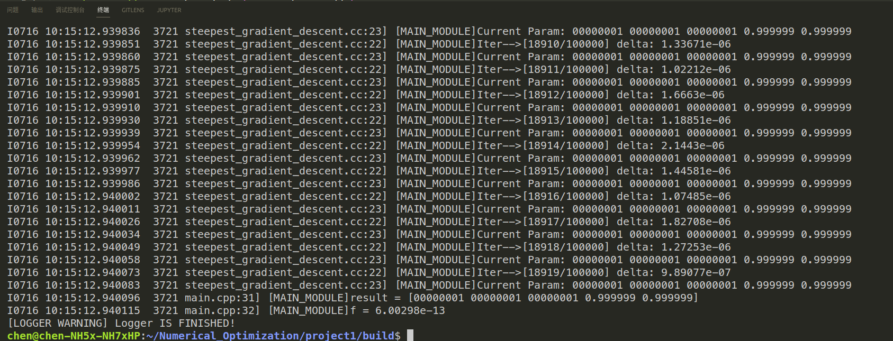
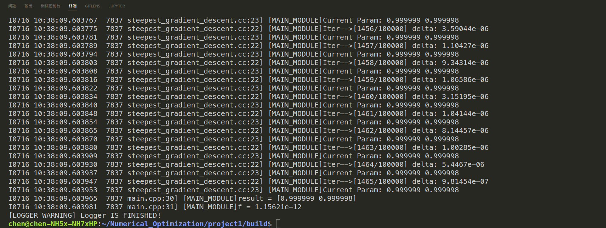
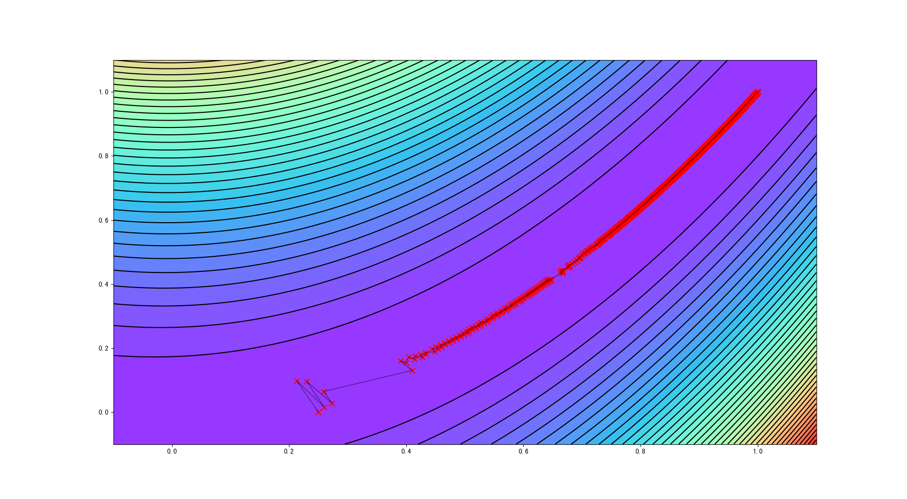

## Linear-search Steepest Gradient Descent

From: https://github.com/ChenJiahao031008/Numerical_Optimization

### 1 Workflow

if you want to use `Linear-search Steepest Gradient Descent` algorithm, please define cost function, which is inherited from class `CostFunction`. And rewrite the `ComputeFunction` and `ComputeJacobian`  function. For example, generate a polynomial function:

```c++
class Example : public CostFunction
{

public:
    Example(Eigen::VectorXd &param) : CostFunction(param){};

    ~Example() = default;

    double ComputeFunction(const Eigen::VectorXd &x) override
    {
        double result = 0;
        result = x[0] * x[0] + 2 * x[1] * x[1] - 2 * x[0] * x[1] - 2 * x[1];
        return result;
    }

    Eigen::VectorXd ComputeJacobian(const Eigen::VectorXd &x) override
    {
        Eigen::VectorXd jacobian(x.rows());
        jacobian(0, 0) = 2 * x[0] - 2 * x[1];
        jacobian(1, 0) = 4 * x[1] - 2 * x[0] - 2;
        return jacobian;
    }
};
```

and instantiate in the main program:

```c++
Eigen::VectorXd x(2);
x << 0.0, 0.0;
Example ex(x);
```

There are two ways to instantiate an SGD solver and set relevant parameters:

```c++
// CASE 1
GradientDescent gd;
gd.SetCostFunction(&ex);
gd.SetEpsilon(1e-6);
gd.SetC(0.5);
gd.SetTau(1.0);
gd.SetMaxIters(100);
gd.SetVerbose(false); // whether the process is printed
// CASE 2
GradientDescent gd(1.0, 0.5, 1e-6, 100, false);
gd.SetCostFunction(&ex);
```

then, use `Solve` function to solve problem:

```c++
auto res = gd.Solve();
```

if you want to record the iteration process, as follows:

```c++
#if GCC_VERSION >= 90400
    namespace fs = std::filesystem;
#else
    namespace fs = boost::filesystem;
#endif
    const std::string recorder_path
        = fs::current_path().string()+ "/" + common::FLAGS_iter_recorder_file;
    fs::path recoder_file(recorder_path);
    AINFO << "Recorder File Path is : " << recoder_file.string();
    if (!fs::exists(recoder_file))
        fs::create_directories(recoder_file.parent_path());
    std::ofstream outfile(recorder_path, std::ios::out);
auto res = gd.Solve(outfile);
```

### 2 Results

1. Multi-dimensional Rosenbrock Function

   

2. Two-dimensional Rosenbrock Function

   

3. Two-dimensional Rosenbrock Function Visualization

   

